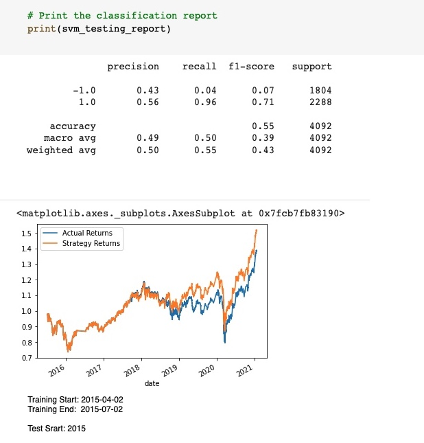
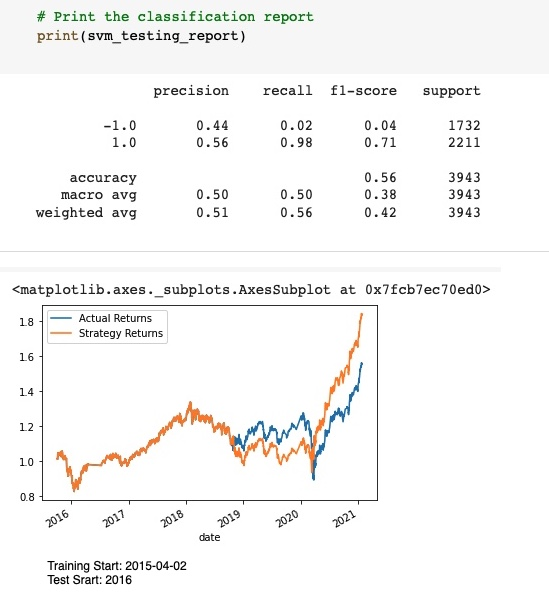
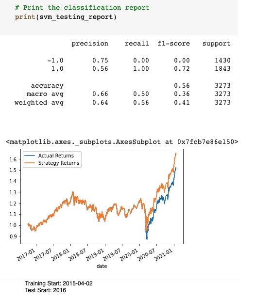
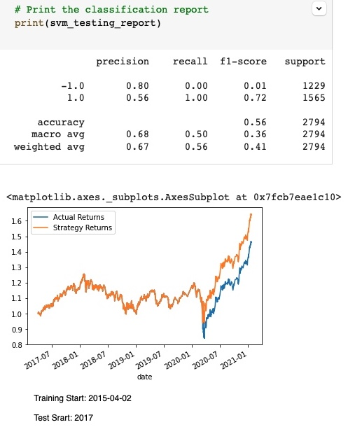
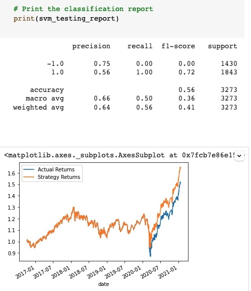
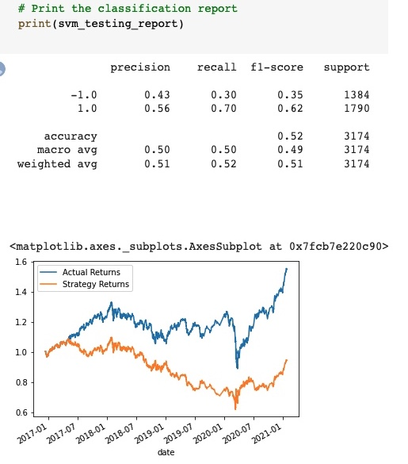
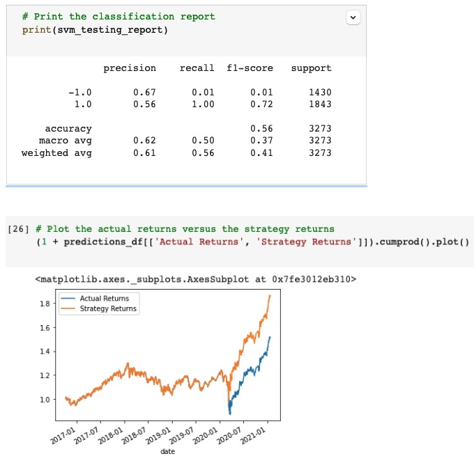
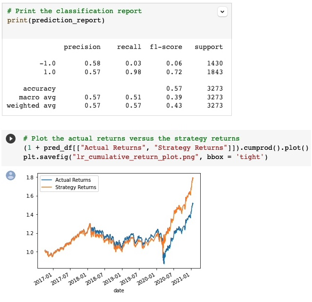

# trading_bot
Machine learning trading bot

# Trading bot Application: new application 

This is a fintech tool that helps in predicting possible crypto trades using historical data.
 

The current project is the inital design and development of the application to get MVP that can be tested on the current market cycle.

---

## Technologies


*[Jupyter](https://jupyter.org/documentation) - For documentation


---

## Installation Guide

Before running the application first install the following dependencies.

```python
  pip install jupyterlab  
  pip install -U scikit-learn
  conda install -c pyviz hvplot
  conda install -c conda-forge imbalanced-learn
  conda install -c conda-forge pydotplus
  pip install --upgrade tensorflow  
    
```

---

## Usage

[GC_machine_learning_trading_bot.ipynb](https://colab.research.google.com/github/odhissm/trading_bot/blob/main/bot_app/GC_machine_learning_trading_bot.ipynb) - to run the application from Google colab

with the:

```jupyter
from command line type

jupyter lab
```

---

## Alternative ML Model and Evaluation of Strategy Returns

**1) Tune the training algorithm by adjusting the size of the training dataset**

    a) 3 months Training period
    


    b) 6 months Training period
    


    c) 18 months Training period
    


    d) 24 months Training period
    



The precision of the prediction improved when moving from 6 to 18 months but got worse when moving to 24 months. It also got a little worse when moving from 6 to 3 months


**2) Tune the trading algorithm by adjusting the SMA input features.**

    a) 4 short-window SMA
    


    b) 8 short-window SMA
    


    c) 2 short-window SMA
    
    
    
    
short-window = 4 for SMA seemd to be the most ideal as it generated a more precise prediction. The prediction got worse on increasing the short-windo to 8 and also when it was lowered to 2 where we couldn't see the both lines on the chart. Looks like a value os 2 may need some more adjusting of the data set to be able to see the two line charts.


**3) Choose the set of parameters that best improved the trading algorithm returns.**

    a) 4 short-window SMA  and 18 month training window generated the best chart with precision of 0.56 
    


---

## Evaluate a New Machine Learning Classifier

**1) Backtest the new model to evaluate its performance.**

        


This model performed a little worse than the tuned model but the precision are 0.57 to 0.56 for the new model compared to the tuned model

---

## Contributors

Brought to you by odhissm@gmail.com

---

## License

MIT
